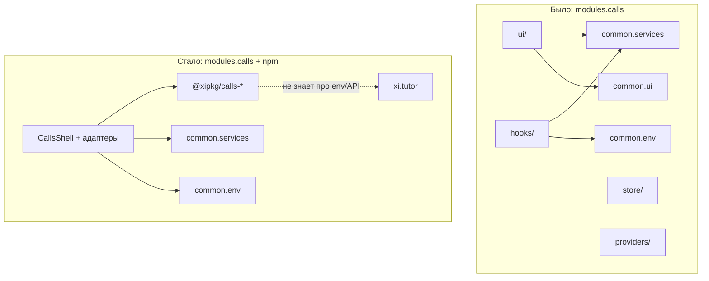

# Миграция `modules.calls` (xi.tutor) → `@xipkg/calls-*`

Руководство по переходу модуля ВКС в xi.tutor с монолитной локальной реализации на опубликованные npm-пакеты из репозитория [xi.calls](https://github.com/xi-effect/xi.calls).

## Зачем

Раньше `modules.calls` в xi.tutor содержал **весь** код ВКС: UI, хуки, store, провайдеры, utils (~100+ файлов). Тот же код вынесен в npm-пакеты `@xipkg/calls-*`, которые публикуются из `packages/` в xi.calls.

После миграции:

- **xi.calls** — разработка и публикация библиотек
- **xi.tutor / `modules.calls`** — тонкий интеграционный слой: провайдеры, адаптеры к `common.services` / `common.env`, навигация TanStack Router

Это убирает дублирование, упрощает обновления ВКС и позволяет использовать calls в других приложениях.

## Карта пакетов

| npm-пакет                  | Содержимое (было в `modules.calls/src/`)                                                   |
| -------------------------- | ------------------------------------------------------------------------------------------ |
| `@xipkg/calls-types`       | `types/` — `StartCallDataT`, `ParticipantTypeT`, noise cancellation                        |
| `@xipkg/calls-config`      | `config/` — `GRID_CONFIG`, `ONBOARDING_IDS`, `getBaselineAudioCaptureOptions`              |
| `@xipkg/calls-utils`       | `utils/` — livekit, chat, sounds, media queries                                            |
| `@xipkg/calls-store`       | `store/` — `useCallStore`, `useFeaturesStore`, `useFocusModeStore`, `useSoundEffectsStore` |
| `@xipkg/calls-providers`   | `providers/` — `RoomProvider`, `LiveKitProvider`, порты для хоста                          |
| `@xipkg/calls-hooks`       | `hooks/` — `useStartCall`, `useModeSync`, `useNoiseCancellation`, …                        |
| `@xipkg/calls-ui`          | `ui/` (кроме Call/CompactView) — VideoGrid, BottomBar, PreJoin, …                          |
| `@xipkg/calls-chat`        | `ui/Chat/`, `hooks/useChat`                                                                |
| `@xipkg/calls-risehand`    | `hooks/useRaisedHands`, `RaiseHandButton`                                                  |
| `@xipkg/calls-compactview` | `ui/CompactView/`, PiP-провайдер                                                           |
| `@xipkg/calls`             | `Call`, `PreJoin`, `ActiveRoom` — точка входа full-screen ВКС                              |

Граф зависимостей (снизу вверх):

```
calls-types
    ↓
calls-config, calls-utils
    ↓
calls-store
    ↓
calls-providers
    ↓
calls-hooks
    ↓
calls-ui, calls-chat, calls-risehand
    ↓
calls-compactview
    ↓
calls
```

## Архитектура до и после



Ключевое изменение: calls-пакеты **не импортируют** `common.services`, `common.env`, `@tanstack/react-router`. Вместо этого хост передаёт зависимости через провайдеры (см. [calls-runtime-config.md](./calls-runtime-config.md)).

## Целевая структура `modules.calls`

После миграции модуль — ~6 файлов, без `src/ui`, `src/hooks`, `src/store`:

```
modules.calls/
├── package.json
├── index.ts
└── src/
    ├── CallsShell.tsx              # дерево провайдеров
    ├── useCallsDeps.ts             # common.services → CallsProviderDepsT
    ├── createCallsRuntimeConfig.ts # common.env → CallsRuntimeConfigT
    ├── useTanstackCallsNavigation.ts
    └── callsSession.ts             # сброс UI при disconnect
```

Эталонные файлы: [xi-tutor-examples/](./xi-tutor-examples/).

## Шаг 1. Зависимости

### `package.json` — добавить

```json
{
  "dependencies": {
    "@xipkg/calls": "^0.0.0",
    "@xipkg/calls-compactview": "^0.0.0",
    "@xipkg/calls-hooks": "^0.0.0",
    "@xipkg/calls-providers": "^0.0.0",
    "@xipkg/calls-store": "^0.0.0",
    "@livekit/components-styles": "1.1.6"
  }
}
```

Версии подставьте актуальные с [npmjs.com](https://www.npmjs.com/org/xipkg). В монорепо xi.tutor можно временно использовать `"workspace:*"` при link на локальный xi.calls.

### `package.json` — удалить

Все прямые зависимости, которые теперь приходят транзитивно из `@xipkg/calls*`:

- `@livekit/*`, `livekit-client`, `driver.js`, `@dnd-kit/*`, `@react-hook/latest`
- `@xipkg/calls-utils` (если был единственным calls-пакетом)
- дубликаты `@xipkg/button`, `@xipkg/icons`, … — оставить только если используются **вне** ВКС в том же модуле

**Оставить** (только для адаптеров):

- `common.services`, `common.env`
- `@tanstack/react-router` (навигационный адаптер)
- `sonner`, `framer-motion` — если нужны на уровне shell (toast в demo)

## Шаг 2. Адаптер зависимостей API

`common.services` больше не импортируется внутри calls-кода. Вместо этого — порт `CallsProviderDepsT`:

| Порт                                | Было (`common.services`)                | Стало                               |
| ----------------------------------- | --------------------------------------- | ----------------------------------- |
| `auth.useCurrentUser`               | `useCurrentUser`                        | передать хук как есть               |
| `room.useGetClassroom`              | `useGetClassroom`                       | передать хук как есть               |
| `room.useAddClassroomMaterials`     | `useAddClassroomMaterials`              | `{ addClassroomMaterials }` из хука |
| `room.useGetClassroomMaterialsList` | `useGetClassroomMaterialsList`          | передать хук как есть               |
| `callAuth.createTokenByTutor`       | `useCreateTokenByTutor().mutateAsync`   | обёртка в `useCallsDeps`            |
| `callAuth.createTokenByStudent`     | `useCreateTokenByStudent().mutateAsync` | обёртка в `useCallsDeps`            |
| `callAuth.reactivateCall`           | `useReactivateCall().mutateAsync`       | обёртка в `useCallsDeps`            |
| `updateParticipantMetadata`         | `useUpdateParticipantMetadata`          | обёртка                             |
| `conferenceMetadata`                | `useUpdateConferenceMetadata`           | обёртка                             |
| `appConfig.getClassroomJoinLink`    | inline с `env.VITE_APP_DOMAIN`          | см. пример                          |

`useCallsDeps` **должен быть хуком** — порты `callAuth` и metadata используют react-query мутации:

```ts
// src/useCallsDeps.ts — см. полный пример в xi-tutor-examples/useCallsDeps.ts
export const useCallsDeps = (): CallsProviderDepsT => {
  const { createTokenByTutor, ... } = useCreateTokenByTutor();
  // ...
  return useMemo(() => ({ ... }), [/* deps */]);
};
```

## Шаг 3. Runtime config (env)

Env больше не читается в config-пакете. См. [calls-runtime-config.md](./calls-runtime-config.md).

```ts
// src/createCallsRuntimeConfig.ts
import { env } from 'common.env';

export const createCallsRuntimeConfig = () => ({
  liveKit: {
    serverUrl: env.VITE_SERVER_URL_LIVEKIT,
    serverUrlDev: env.VITE_SERVER_URL_LIVEKIT_DEV,
    isDevMode: env.VITE_LIVEKIT_DEV_MODE,
    devToken: env.VITE_LIVEKIT_DEV_TOKEN,
  },
  noiseCancellation: {
    featureEnabled: env.VITE_NOISE_CANCELLATION_FEATURE_ENABLED,
    allowKrisp: env.VITE_ALLOW_KRISP_NOISE_CANCELLATION,
  },
});
```

Удалите `modules.calls/src/utils/config.ts` — `getBaselineAudioCaptureOptions` теперь в `@xipkg/calls-config`.

## Шаг 4. Навигация

Хуки calls-пакетов больше не вызывают `useNavigate()` напрямую. Реализуйте `UseCallsNavigationHookT` для маршрутов xi.tutor:

```ts
// src/useTanstackCallsNavigation.ts
// Полный пример: apps/web/src/calls/useTanstackCallsNavigation.ts
// или xi-tutor-examples/useTanstackCallsNavigation.ts
```

Маршруты xi.tutor должны соответствовать ожиданиям calls:

| Метод                                   | Маршрут xi.tutor                                     |
| --------------------------------------- | ---------------------------------------------------- |
| `navigateToCall(id)`                    | `/call/$callId?call=<id>`                            |
| `navigateToClassroomOverview(id)`       | `/classrooms/$classroomId?tab=overview&call=<id>`    |
| `navigateToClassroomBoard(id, boardId)` | `/classrooms/$classroomId/boards/$boardId?call=<id>` |

## Шаг 5. `CallsShell` — дерево провайдеров

Оберните страницы с ВКС в shell (аналог `apps/web/src/calls/CallsDemoShell.tsx`):

```tsx
// src/CallsShell.tsx
<CallsRuntimeConfigProvider config={runtimeConfig}>
  <CallsNavigationProvider useNavigation={useTanstackCallsNavigation}>
    <CallsSessionProvider session={callsSessionPort}>
      <CallsProvider deps={deps}>
        <RoomProvider>
          <LiveKitProvider>
            <ModeSyncProvider>{children}</ModeSyncProvider>
          </LiveKitProvider>
        </RoomProvider>
      </CallsProvider>
    </CallsSessionProvider>
  </CallsNavigationProvider>
</CallsRuntimeConfigProvider>
```

Порядок провайдеров важен:

1. `CallsRuntimeConfigProvider` — выше всего calls-дерева
2. `CallsNavigationProvider`
3. `CallsSessionProvider`
4. `CallsProvider` (deps из `useCallsDeps()`)
5. `RoomProvider` → `LiveKitProvider` → `ModeSyncProvider`

В xi.tutor добавьте `CallsShell` в layout маршрутов `/call/*`, `/classrooms/*` (где есть compact overlay), а не в каждую страницу отдельно.

### CSS

Подключите один раз в shell или в entry приложения:

```ts
import '@livekit/components-styles';
import '@xipkg/calls-ui/video-security.css';
import '@xipkg/calls-ui/driver.css';
```

Удалите локальный импорт `./shared/VideoTrack/video-security.css`.

## Шаг 6. Публичный API (`index.ts`)

Сохраните обратную совместимость экспортов для потребителей xi.tutor:

```ts
// index.ts
export { Call } from '@xipkg/calls';
export { CompactView } from '@xipkg/calls-compactview';
export {
  RoomProvider,
  LiveKitProvider,
  CallsProvider,
  CallsRuntimeConfigProvider,
  CallsNavigationProvider,
  CallsSessionProvider,
} from '@xipkg/calls-providers';
export {
  ModeSyncProvider,
  useModeSync,
  useStartCall,
  useUmamiActivityHeartbeat,
} from '@xipkg/calls-hooks';
export { useCallStore } from '@xipkg/calls-store';
export { CallsShell } from './src/CallsShell';
```

Компоненты, которые раньше импортировали `useCallStore` / `useStartCall` из `modules.calls`, продолжат работать без изменений импортов.

## Шаг 7. Подключение в xi.tutor

### Было

```tsx
import { Call, LiveKitProvider, RoomProvider } from 'modules.calls';

<RoomProvider>
  <LiveKitProvider>
    <Call />
  </LiveKitProvider>
</RoomProvider>;
```

### Стало

```tsx
import { Call, CallsShell } from 'modules.calls';

<CallsShell>
  <Call />
</CallsShell>;
```

Провайдеры `RoomProvider` / `LiveKitProvider` / `ModeSyncProvider` уже внутри `CallsShell`.

### Compact overlay

```tsx
import { CompactView, CallsShell } from 'modules.calls';

<CallsShell>
  <CompactView />
</CallsShell>;
```

`CompactView` из `@xipkg/calls-compactview` сам читает `?call=` через `useCallsNavigation()`.

## Шаг 8. Что удалить из `modules.calls`

Удалите целиком (код есть в npm):

```
src/ui/
src/hooks/
src/store/
src/providers/        # кроме если есть xi.tutor-специфичное — обычно нет
src/types/
src/config/
src/utils/            # кроме xi.tutor-only утилит
src/styles/grid.css   # если не используется снаружи
BOARD_SYNC_CASES.md   # перенести в docs xi.calls при необходимости
```

## Таблица замены импортов

| Было в `modules.calls`                                           | Стало                                    |
| ---------------------------------------------------------------- | ---------------------------------------- |
| `from '../store/callStore'`                                      | `from '@xipkg/calls-store'`              |
| `from '../hooks/useStartCall'`                                   | `from '@xipkg/calls-hooks'`              |
| `from '../providers/RoomProvider'`                               | `from '@xipkg/calls-providers'`          |
| `from '../utils/config'` (`serverUrl`, `isDevMode`, …)           | `useCallsRuntimeConfig()`                |
| `from 'common.env'` в UI calls                                   | `createCallsRuntimeConfig()` + провайдер |
| `from 'common.services'` в UI/hooks calls                        | `useCalls()`                             |
| `from 'common.ui'` (`useFocusModeStore`, `useSoundEffectsStore`) | `from '@xipkg/calls-store'`              |
| `from '@tanstack/react-router'` в calls-хуках                    | `useCallsNavigation()`                   |
| `from '../hooks/useModeSync'`                                    | `from '@xipkg/calls-hooks'`              |
| `./shared/VideoTrack/video-security.css`                         | `@xipkg/calls-ui/video-security.css`     |

## Особые случаи

### `useFocusModeStore` / `useSoundEffectsStore`

Раньше жили в `common.ui`, теперь — в `@xipkg/calls-store`. Если xi.tutor использовал эти store **вне** ВКС, переключите импорт на `@xipkg/calls-store` или продублируйте store в `common.ui` (не рекомендуется).

### `useUmamiActivityHeartbeat`

Остался в `@xipkg/calls-hooks`. Проверьте, что umami-скрипт подключён в xi.tutor как раньше.

### Feature flags (чат, рука, доска)

```tsx
import { useFeaturesStore } from '@xipkg/calls-store';

useFeaturesStore.getState().setFeatures({
  chat: true,
  raiseHand: true,
  whiteboard: true,
});
```

Вызовите при инициализации shell или из конфига xi.tutor.

### Dev-mode LiveKit

Если `VITE_LIVEKIT_DEV_MODE=true`, положите dev-токен в store (см. `apps/web/src/calls/CallsDemoShell.tsx`, компонент `CallsDemoInit`).

## Vite / monorepo (опционально)

Для локальной разработки xi.tutor + xi.calls без publish:

```ts
// vite.config.ts xi.tutor
resolve: {
  conditions: ['development', 'import'],
}
```

Condition `development` в `exports` calls-пакетов отдаёт исходники (`index.ts`) для HMR. В production npm-потребители получают `dist/`.

## Checklist миграции

- [ ] Установить `@xipkg/calls`, `@xipkg/calls-compactview`, `@xipkg/calls-hooks`, `@xipkg/calls-providers`, `@xipkg/calls-store`
- [ ] Создать `useCallsDeps`, `createCallsRuntimeConfig`, `useTanstackCallsNavigation`, `callsSession`
- [ ] Создать `CallsShell` и подключить в layout маршрутов с ВКС
- [ ] Подключить CSS: `@livekit/components-styles`, `@xipkg/calls-ui/video-security.css`, `@xipkg/calls-ui/driver.css`
- [ ] Обновить `index.ts` — re-export из npm-пакетов
- [ ] Заменить ручную обёртку `RoomProvider`/`LiveKitProvider` на `CallsShell`
- [ ] Удалить legacy `src/ui`, `src/hooks`, `src/store`, `src/providers`, `src/utils/config.ts`
- [ ] Убрать лишние dependencies из `package.json`
- [ ] Прогнать сценарии из BOARD_SYNC (collaborative mode, compact/full, доска)
- [ ] Проверить: PreJoin, full call, compact overlay, чат, поднятие руки, шумоподавление, onboarding

## Связанные документы

- [calls-runtime-config.md](./calls-runtime-config.md) — injectable env
- [calls-package-rename.md](./calls-package-rename.md) — `common.types` → `@xipkg/calls-types`
- [calls-build.md](./calls-build.md) — сборка и npm publish
- [xi-tutor-examples/](./xi-tutor-examples/) — эталонные адаптеры для копирования
- Demo-приложение: `apps/web/src/calls/` в xi.calls
